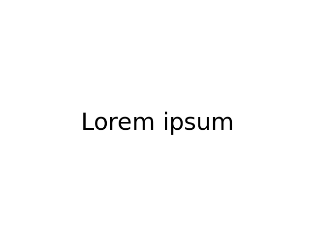
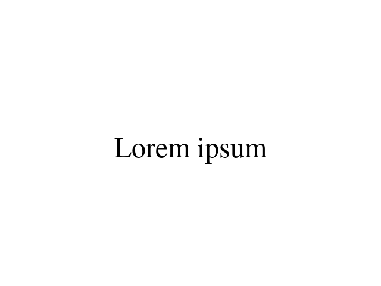

# generate-placeholder-image

This JS library lets you create placeholder images via JavaScript.

**Attention:** This library currently only supports PNG.

## Usage

### Within your application

* Install this library in your project:
    ```bash
    npm i generate-placeholder-image
    ```

* Import the generator function
    ```javascript
    const generatePlaceholderImage = require('generate-placeholder-image')
    ```
  
* Start using it:
    ```javascript
    generatePlaceholderImage({
      width: 300,
      height: 300,
      r: 255,
      g: 255,
      b: 0,
      text: 'Hello, World!',
      output: '/some/directory/images/placeholder.png'
    })
    ```

#### Config reference with default values

```javascript
{
    width: 640,
    height: 480,
    r: 255,
    g: 255,
    b: 255,
    text: 'Lorem ipsum',
    font: 'san-serif',
    output: './image.png'
}
```

### As a standalone script

* Installing it globally:
    ```bash
    npm i -g generate-placeholder-image
    ```

* Start using it:
    ```bash
    generate-placeholder-image -w 300 -h 300 -r 255 -g 255 -b 0 -t 'Hello, World!' -o '/some/directory/images/placeholder.png'
    ```

* Or use it via `npx`:
    ```bash
    npx generate-placeholder-image -w 300 -h 300 -r 255 -g 255 -b 0 -t 'Hello, World!' -o '/some/directory/images/placeholder.png'
    ```

#### CLI config reference with default values

```
Placeholder image generator

  Create placeholder images with a single line of bash! 

Arguments

  -w, --width number    Width of the image. Default: 640                                    
  -h, --height number   Height of the image. Default: 480                                   
  -r, --red number      Red part, 0-255. Default: 255                                       
  -g, --green number    Green part, 0-255. Default: 255                                     
  -b, --blue number     Blue part, 0-255. Default: 255                                      
  -t, --text string     Text to put on image. Default: "Lorem ipsum"                        
  -f, --font string     Font the text will be rendered in. Default: "sans-serif"            
  -o, --output string   Path of the image. Default: "./image.png"                           
  --help                Prints this help                                                    
  -v, --version         Prints the version                                                  
  --open                Opens the image in your default image viewer afterwards (Linux, OSX and Windows)

Example

  ./generate.js -w 100 -h 100 -r 0 -g 0 -b 255 -t "Hello, World!" -f Helvetica  
  -o ./placeholder.png     
```

## Examples

Executing this (all-default parameters, except `--output`/`-o` or equivalent parameters for the generator function):

```bash
generate-placeholder-image -o ./expamples/image.png
```

produces:



---

Executing this (changed font):

```bash
generate-placeholder-image -f Times -o ./examples/times.png
```

produces this:



---

Executing this (or equivalent parameters for the generator function):

```bash
generate-placeholder-image -w 300 -h 150 -r 255 -g 255 -b 0 -t 'Hello, World!' -o ./examples/hello-world.png
```

produces this:


